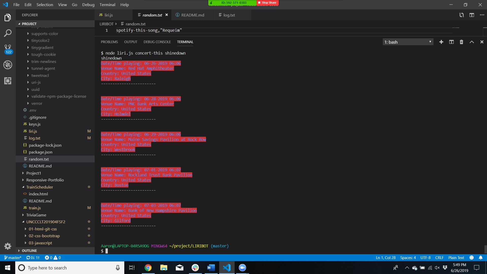
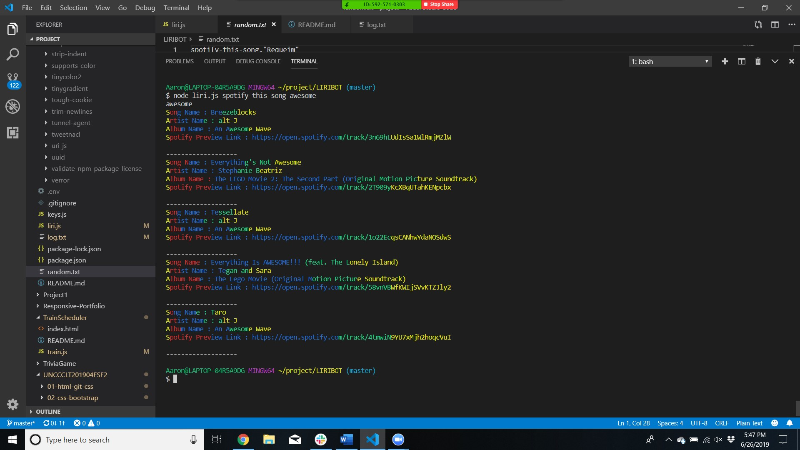
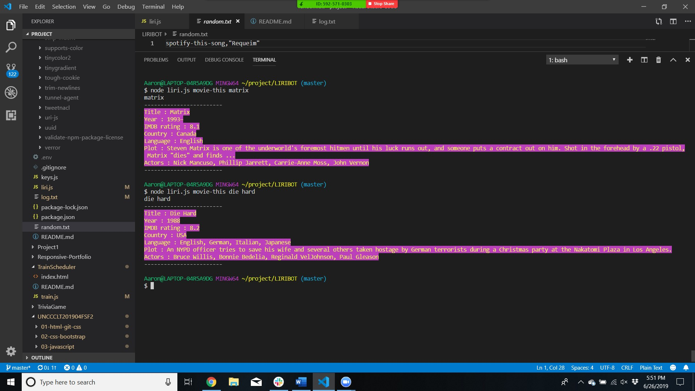
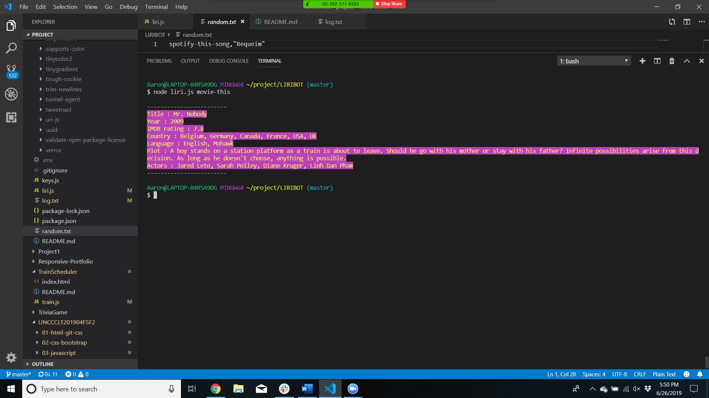
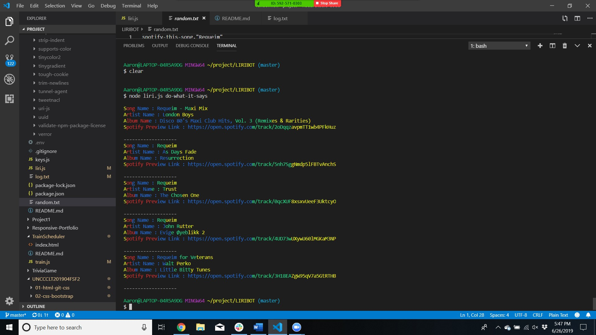
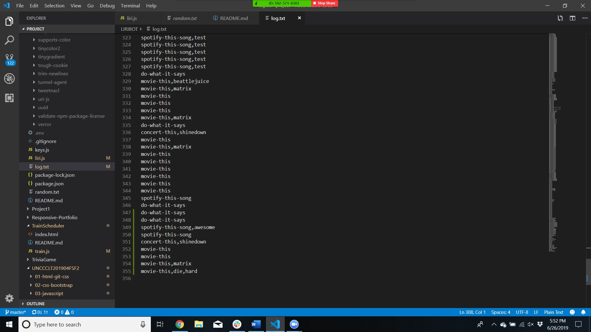

# LIRIBOT

The point of the LIRI BOT is to execute a series of AXIOS calls and commands to various API's based on user input and return the value of there search and translate that into node.

How the app will be organized is if the uses the following commands it will execute a search based on what they are requesting.

Here are the commands to search using LIRIBOT. While using these commands the parenthesis is a placeholder for what you are searching for and needs to be replaced accordingly.

# concert-this (band name)

We will take this command and make a api call using AXIOS to get the following information:

* Name of the venue
* Venue location
* Date of the Event (use moment to format this as "MM/DD/YYYY")

# spotify-this-song (song name)

We will take the song name that the user is searching for and will return the following based on the npm spotify-node-api.

* Artist(s)
* The song's name
* A preview link of the song from Spotify
* The album that the song is from
    

 If no value is inputed for the command spotify-this-song then we submit a default search for the song: The Sign.

 
# movie-this (movie name)

We will take the movie name and make a AXIOS call to the OMDB api for the following information:

* Title of the movie.
* Year the movie came out.
* IMDB Rating of the movie.
* Country where the movie was produced.
* Language of the movie.
* Plot of the movie.
* Actors in the movie.

If the command movie-this is executed we do a default search for the movie Mr. Nobody.

 # do-what-it-says (source random.txt)

 Will read the contents of random.txt and will perform the command and query based on what is listed in the random.txt file.

# Log command text file

With all the code in place for the bonus portion of the assignment I make a log for every command that has been executed through the birth of the program and the parameter that has been searched.

---

We are going to be using npm for the axios, spotify, omdb, and bands in town.

The goal of the project is to have a firm understanding of node.js and the power that it can provide on the back end.

Click here for the code :  [code here](https://github.com/ABooth9422/LIRIBOT.git)

The Following resources were used for this app:

* AXIOS
* Moment
* spotify-node-api
* bands in town
* omdb api
* chalk
* gradient-string

[Aaron Booth](https://abooth9422.github.io/) was the sole contributor to this git.